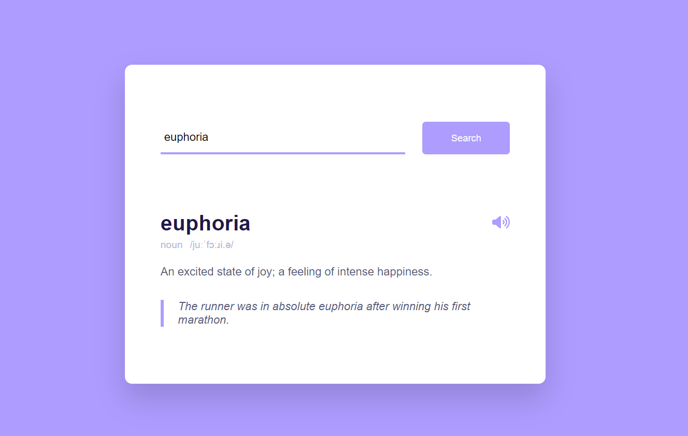

# Dictionary with JS
A dictionary made with Javascript and an API

### Screenshot

### Links

- You can use the dictionary [here](https://onanuviie.github.io/Dictionary-with-JS/)
- See free API used [here](https://dictionaryapi.dev/)

## My process

### Built with

- Semantic HTML5 markup
- CSS custom properties
- Flexbox
- A dictionary API
- setAttribute()

### What I learnt
This was my first time working with APIs and it was really fun. I learnt how to fetch data and properly copy paths to use in my projects

